# Android_Backend_Samples
Simple Android code examples that you could use in the "front-end" of an Android app

# Description
This repository contains a collection of simple Android projects containing tips on how to
build user interface components using the Android SDK.

# TO-DOs
To find the steps on how to program the source code on your own,
press Control + Shift + F in Android Studio to open the search tool.

Once the search tool is opened, type in "TODO" in the search field to find comments throughout the source code.

# Note:
Gradle and Android Plugins versions in each project may vary.

#Projects preview - in order
#1) Recyclerview with different layouts
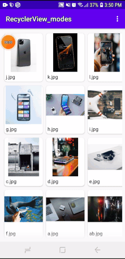

#2) Recyclerview with search bar
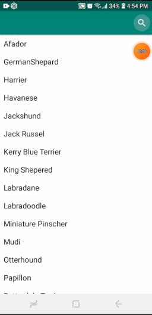

#3) Recyclerview with movable rows
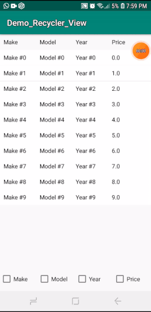

#4) Bottom navigation
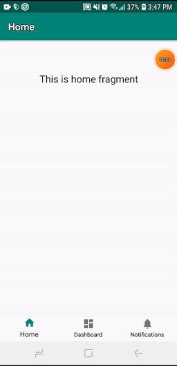

#5) Date picker
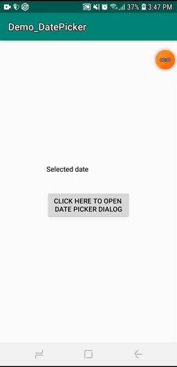

#6) Preference fragment
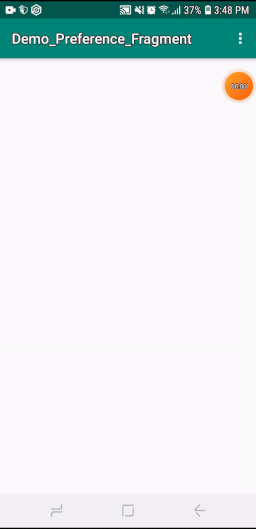

#7) Full screen
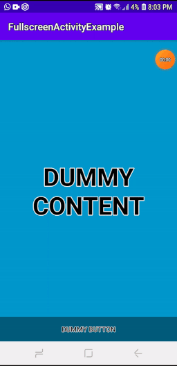

#8) Master detail flow
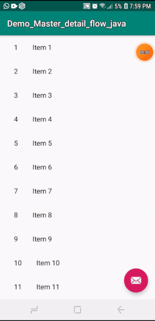

#9) Navigation drawer
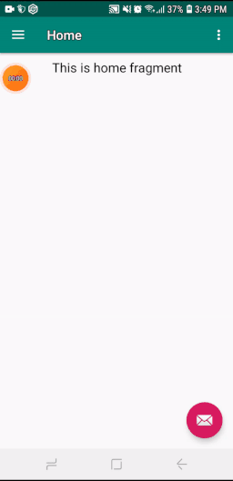

#10) Scrolling activity
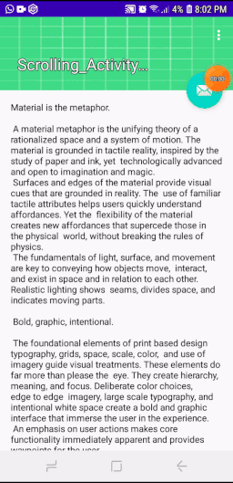

#11) Activity with tabs
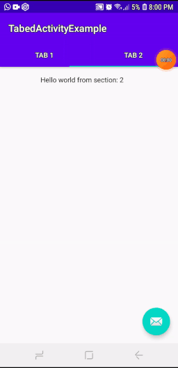
